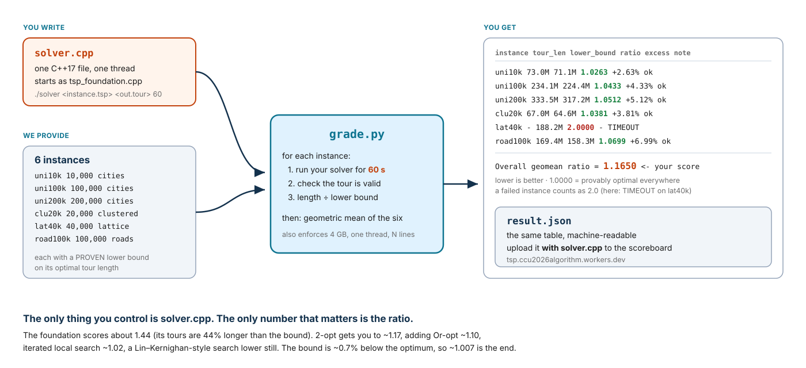

# Euclidean TSP — Approximation Competition

You are given a working 2-approximation for the metric Travelling Salesman
Problem, `tsp_foundation.cpp` (minimum spanning tree, then a preorder walk —
slide 28 of *Approximation Algorithms*). Copy it to `solver.cpp` and make its
tours **shorter**. Same input, a valid tour out, 60 seconds, one thread.

This is not a speed contest. Every solver gets the same 60 s per instance.
What is measured is **how close your tour is to the optimum**: the length of
your tour divided by a proven lower bound on the optimal tour. 1.000 would be
optimal. The foundation scores about 1.45.

**Your entire job is one C++ file.** Everything else — running, timing,
checking, scoring — is done by one Python script, `grade.py`. You hand in
`solver.cpp` and the `result.json` it writes by uploading them to the
scoreboard at **https://tsp.ccu2026algorithm.workers.dev**
(see [What to submit](#what-to-submit)).

## How the pieces fit



You only touch `solver.cpp`. One command produces the table on the right, and
the `Overall geomean ratio` line is your score. **Lower is better.**

## Quick start

```sh
git clone https://github.com/ythuang0522/tsp-competition.git && cd tsp-competition
make foundation                        # 1. build the baseline
cp tsp_foundation.cpp solver.cpp       # 2. this file is your assignment
make solver                            #    ...edit solver.cpp, rebuild...
python3 grade.py --solver ./solver --instances instances_dev.txt              # 3. quick check (1 min)
python3 grade.py --solver ./solver --instances instances.txt --json result.json   # 4. score (6 min)
```

Step 4 prints a table and writes `result.json`. Before you change anything,
`solver.cpp` *is* the foundation, so this is what you see (times in seconds):

```
category   instance         n  limit    wall    tour_len  lower_bound    ratio   excess  note
----------------------------------------------------------------------------------------------------
RANDOM     uni1k         1000     60     0.0    33183622     23207105   1.4299   42.99%  ok
RANDOM     uni10k       10000     60     0.1   100746939     71139777   1.4162   41.62%  ok
RANDOM     uni100k     100000     60     9.8   320153923    224358454   1.4270   42.70%  ok
RANDOM     clu20k       20000     60     0.4    91945014     64586184   1.4236   42.36%  ok
STRUCTURED lat40k       40000     60     1.6   264759613    188150069   1.4072   40.72%  ok
STRUCTURED road30k      30000     60     1.0    89791312     56657341   1.5848   58.48%  ok

Random     geomean ratio = 1.4242  (n=4)
Structured geomean ratio = 1.4934  (n=2)
Overall    geomean ratio = 1.4469  (n=6)   <- your score; lower is better, 1.0000 is optimal
```

As you improve `solver.cpp` the `ratio` column falls towards 1. For
orientation, measured on this machine: 2-opt on neighbour lists alone reaches
about 1.17 overall, adding Or-opt about 1.10, and adding perturbation
(iterated local search) about 1.02. An illustrative result for a solver of
that last kind that runs out of time on one instance:

```
category   instance         n  limit    wall    tour_len  lower_bound    ratio   excess  note
----------------------------------------------------------------------------------------------------
RANDOM     uni1k         1000     60    59.9    23594664     23207105   1.0167    1.67%  ok
RANDOM     uni10k       10000     60    59.9    73010753     71139777   1.0263    2.63%  ok
RANDOM     uni100k     100000     60    59.9   234073175    224358454   1.0433    4.33%  ok
RANDOM     clu20k       20000     60    59.9    67046918     64586184   1.0381    3.81%  ok
STRUCTURED lat40k       40000     60    61.0           -    188150069   2.0000        -  TIMEOUT
STRUCTURED road30k      30000     60    59.9    58917969     56657341   1.0399    3.99%  ok

Overall    geomean ratio = 1.1531  (n=6)   <- your score; lower is better, 1.0000 is optimal
```

`note=ok` means a valid tour was written in time. Anything else means that
instance scored **2.0** — the worst the 2-approximation can ever do — and the
`TIMEOUT` line above cost this solver most of its score (without it the mean
would be about 1.033). A valid tour first, then a short one. Manage your
clock: the limit is `argv[3]`, the grader kills you two seconds after it
whatever you were about to write, and its clock starts before yours (process
start-up counts). **Stop improving at least one second early** and write the
tour; on a busy laptop a solver that runs to the last millisecond gets killed.

That is the whole workflow. Repeat step 4 as you improve `solver.cpp`, and
upload the two files whenever you want to see where you stand.

### Iterating quickly

The scored run takes six minutes if your solver uses its whole budget. While
you work, use the dev set, which is already in the repo, has the same six
families at 200–10,000 cities, and gives each 10 s:

```sh
python3 grade.py --solver ./solver --instances instances_dev.txt
```

The dev set is for checking validity and rough quality. Only `instances.txt`
is scored.

## The rules

Your `solver.cpp` must:

1. Start from `tsp_foundation.cpp`. You may replace any part of it, but keep
   the command line: `./solver <instance.tsp> <output.tour> <time_limit_s>`.
2. Write a **valid tour**: exactly N lines, a permutation of `0..N-1`.
3. Finish within the time limit given as `argv[3]` (60 s on the scored set).
   The grader kills the process two seconds after the limit; a run that is
   killed scores 2.0 even if a good tour was about to be written.
4. Be C++17 using only the standard library.
5. Be a single file: everything you write lives in `solver.cpp`, with no
   headers of your own. `#include` only standard library headers.
6. Be single-threaded.
7. Stay under 4 GB of memory.
8. Read nothing but the instance file. No cached tours, no precomputed
   answers in the source, no other files.

`grade.py` enforces rules 2, 3, 6 and 7 automatically. Rules 1, 4, 5 and 8
are checked by reading your `solver.cpp`. Randomised solvers are fine: the
grader runs you once, and what that run produces is your score.

## What to submit

Upload two files to the scoreboard:

**https://tsp.ccu2026algorithm.workers.dev**

- `solver.cpp`, the whole of your work in that one file
- `result.json`, written by step 4

Nothing else. `result.json` already records your tour lengths, the bounds,
the score, and the SHA-256 of the `solver.cpp` it was measured from — so
upload the two files from the same run.

### How to upload

1. Open the scoreboard and click **Submit** (top right).
2. Enter your **Student ID** exactly as it appears in the course roster. It is
   shown publicly on the board.
3. Choose your `result.json` and your `solver.cpp`.
4. Click **Submit and view ranking**.

The server re-derives your score from the per-instance tour lengths in
`result.json` and its own copy of the bounds, ranks on that, then redirects
you to the board with your row highlighted. Your `solver.cpp` is stored for
the instructor only; it is never shown to other students.

- **You may submit as many times as you like** before the deadline. Every
  attempt is kept; your **best (lowest)** score is the one that ranks (the
  *Tries* column counts attempts).
- The board closes at the deadline shown in the header (**18 Oct 2026,
  23:59 Taipei**). Late uploads are refused.
- **Overall / Random / Structured** switch the ranking key; Overall is the
  official one.
- Uploads that were not produced by `grade.py --json`, that come from the dev
  set, that used a different time limit, or that claim a tour shorter than
  the proven bound are rejected with a message telling you what is wrong.

## How the score works

For each instance:

```
ratio = tour_length / lower_bound
```

where `lower_bound` is a **proven** lower bound on the optimal tour length of
that instance (see below). Your score is the geometric mean of the six
ratios. **Lower is better**; 1.0000 is the unreachable floor.

- **A failed instance scores 2.0 and still counts.** An invalid tour, a
  timeout, too much memory, or extra threads on one instance drags your mean
  up; they are never dropped. Running the unmodified foundation on an
  instance (≈1.45) is always better than failing it.
- Four instances are **RANDOM** (uniform and clustered points), two are
  **STRUCTURED** (a lattice and road-like polylines). `grade.py` reports the
  two sub-means, but the overall geometric mean is your score.
- **The bound is not the optimum.** On random points it is typically 0.5–1%
  below it, so a ratio of 1.02 means "at most 2% above optimal, probably about
  1.3% above". On `road30k` the gap is larger and unknown: the best tour anyone
  has found is 6% above the bound. Nobody will reach 1.000; the interesting
  range is 1.01–1.06, so the board shows four decimals.
- **Machine speed matters a little.** A faster laptop gets more iterations in
  the same 60 s. The effect is small next to the algorithmic differences, and
  the instructor re-runs the top submissions on one machine before final
  grades.

### What the notes mean

| note | meaning | ratio for that instance |
|---|---|---|
| `ok` | valid tour, within limits | `tour_length / lower_bound` |
| `INVALID` | not a permutation of 0..N-1 (`invalid_reason` in result.json says why) | 2.0 |
| `TIMEOUT` | still running two seconds after the limit | 2.0 |
| `MEMORY` | exceeded 4 GB | 2.0 |
| `THREADS` | used more than one thread | 2.0 |
| `CRASH` / `NOOUTPUT` | non-zero exit, or no output file written | 2.0 |

## The data

Six instances are scored. Each is a different kind of point set, so a trick
that helps on one may not help on another:

| instance | cities | family | what it is | lower bound | reference | foundation |
|---|---:|---|---|---:|---:|---:|
| `uni1k` | 1,000 | RANDOM | uniform random points; small enough to get very close to optimal | 23,207,105 | 1.0088 | 1.4299 |
| `uni10k` | 10,000 | RANDOM | uniform random points | 71,139,777 | 1.0123 | 1.4162 |
| `uni100k` | 100,000 | RANDOM | uniform random points; anything quadratic per pass is too slow | 224,358,454 | 1.0134 | 1.4270 |
| `clu20k` | 20,000 | RANDOM | Gaussian clusters whose density varies 1000×, plus a thin background | 64,586,184 | 1.0120 | 1.4236 |
| `lat40k` | 40,000 | STRUCTURED | a jittered 200×200 lattice: plateaus of equal-length moves everywhere | 188,150,069 | 1.0026 | 1.4072 |
| `road30k` | 30,000 | STRUCTURED | points along random streets with junction knots | 56,657,341 | 1.0604 | 1.5848 |

*reference* is the ratio reached by the instructor's own local-search solver
given five minutes; *foundation* is the unmodified starting point. Beating
the reference is entirely possible with a good Lin–Kernighan-style search and
earns a badge on the board.

Each instance is two files in `instances/`: `<name>.tsp` (the points) and
`<name>.meta.json` (the bound and the reference, plus how the points were
made). All coordinates are integers in `[0, 1,000,000]`. The whole scored set
is 3 MB and committed to the repo; there is nothing to download.

The `dev_*` instances are the same six families at 200–10,000 cities.

**The final grading uses fresh instances** generated by the same code with
the same parameters and a different random seed, with bounds computed the
same way. Anything that depends on the exact bytes of the released files will
not carry over; anything that depends on the structure of the point sets
will.

## File formats

```
<instance.tsp>          <output.tour>
N                       p_0
x_0 y_0                 p_1
...                     ...
x_{N-1} y_{N-1}         p_{N-1}       (a permutation of 0..N-1)
```

The tour is the cycle `p_0 → p_1 → … → p_{N-1} → p_0`. The distance between
two cities is the Euclidean distance **rounded to the nearest integer**
(TSPLIB `EUC_2D`), and the tour length is the sum of the N integer edges:

```
d(i, j) = floor( sqrt((xi-xj)² + (yi-yj)²) + 0.5 )
```

`grade.py` computes it exactly this way in 64-bit integers. Use the same
formula in your solver or your own length will disagree with the grader's by
a few hundredths of a percent — enough to matter at the top of the board.

## Everything else (optional reading)

**Sanity-check your environment** before you start:

```sh
make foundation && ./foundation samples/tiny.tsp /tmp/tiny.tour 5 && cat /tmp/tiny.tour
```

It should print a tour of the five sample cities and `tour length 442` on
stderr.

**Where the bound comes from.** `tools/bound/bound.cpp` computes the
Held–Karp 1-tree bound: a subgradient ascent on penalised minimum spanning
trees, evaluated exactly on the complete graph, so the number it prints is a
proven lower bound whatever the ascent did. For random Euclidean instances it
is within about 0.7% of the optimum. You do not need it to compete; it is
there so you can make practice instances with bounds.

**Practice instances.** `tools/gen/` is the real generator. To make fresh
instances with your own seed and bound them:

```sh
make tools                                          # builds tools/bound/bound
python3 -m tools.gen --manifest tools/manifest/public.json \
        --instance uni10k --seed 12345 --salt mine --out mydata
tools/bound/bound mydata/uni10k.tsp --json          # prints {"lower_bound": ...}
```

Put the `lower_bound` into `mydata/uni10k.meta.json`, list the instance in
your own instances file in the same `<category> <file.tsp> <seconds>` format,
and point `--instances` at it.

**`tools/` is instructor tooling.** It is multi-threaded and not part of your
submission, so it is not subject to the rules above.

**Keeping your tours.** `python3 grade.py ... --keep-tours tours/` saves
every tour the grader accepted, which is handy for plotting.

| make target | what it does |
|---|---|
| `make foundation` | build the baseline |
| `make solver` | build your `solver.cpp` |
| `make tools` | build the lower-bound tool |
| `make test` | run `grade.py`'s own regression tests |
